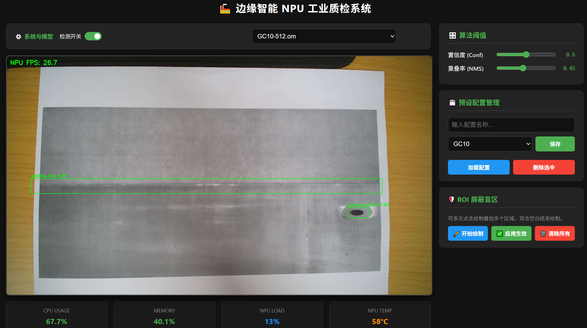

# Metal-Defect-Detection
基于边缘计算的金属零件表面缺陷检测

Yolov8修改地方

./ultralytics/utils/metrics.py
./ultralytics/utils/loss.py

内容
1. 构建了面向金属缺陷检测的 Inner-WIoU 损失函数。引入内辅助边界框机制：通过缩放因子 ratio 为预测框和真实框分别生成内部辅助框，将损失计算聚焦于内部区域，有效剥离了缺陷边缘的模糊背景噪声。保留 WIoU 的动态非单调聚焦机制，在内部交并比计算基础上，继续使用 WIoU 的离群度评估与非单调聚焦因子，抑制低质量样本的梯度干扰，提升缺陷的检测准确率。
2. 除了 Inner-WIoU，还在Yolov8n模型上测试了 WIoU和 GGW-DND两种不同的损失函数，能够分别提升 mAP50和提升召回率。三者在不同数据分布下实现性能互补，且不增加任何推理开销。
3. 基于香橙派 AIpro 实现了边缘计算缺陷检测系统并完成实机落地。华为昇腾 ATC 工具链的模型转化与 NPU 加速，将 PyTorch 模型转化为.om 格式，在香橙派 AIpro 上实现较高的推理速度。构建完整的 B/S 架构实时质检系统，基于 Flask 开发的多线程 Web 系统，集成以下工业级功能：动态 ROI 盲区屏蔽、算法阈值热更新、多模型热切换与 NPU 开关、检测参数持久化存储、硬件状态实时监控与高温预警。

图片

设备：

检测系统：

